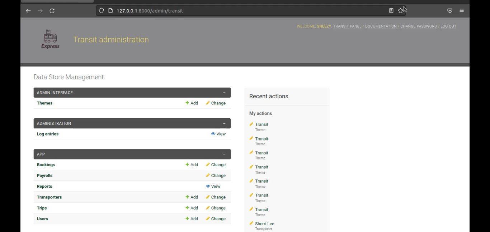
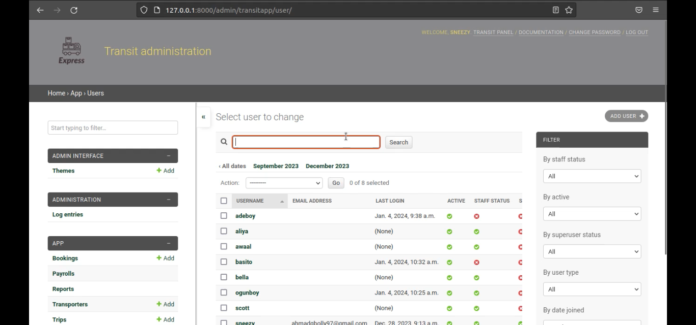
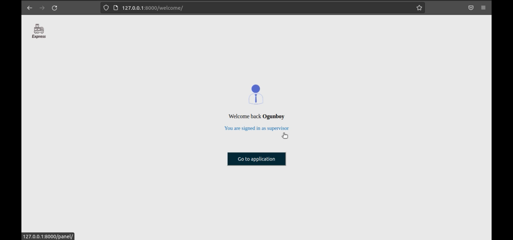
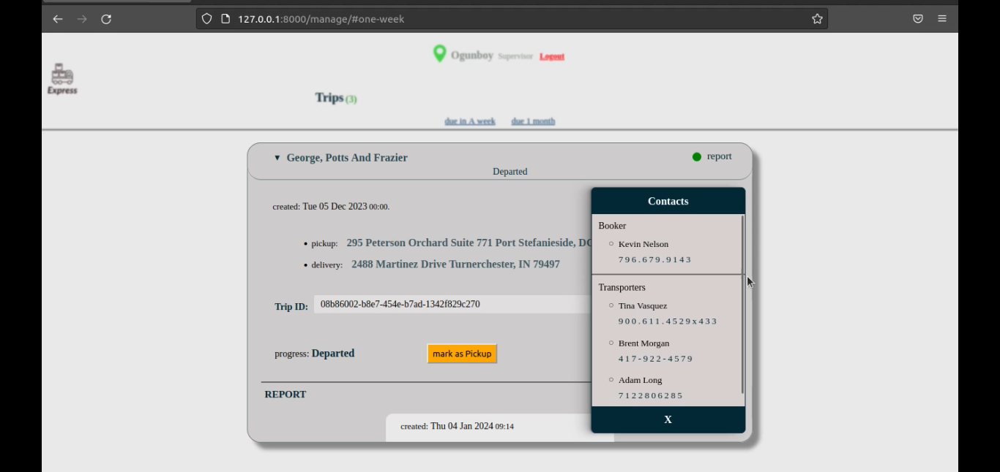
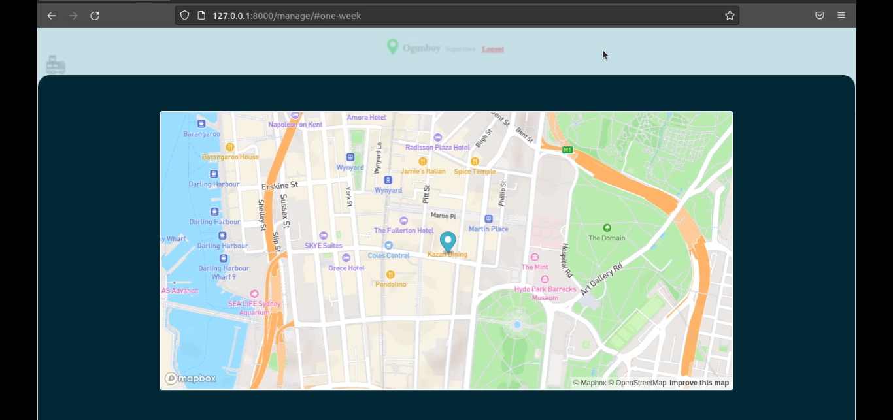
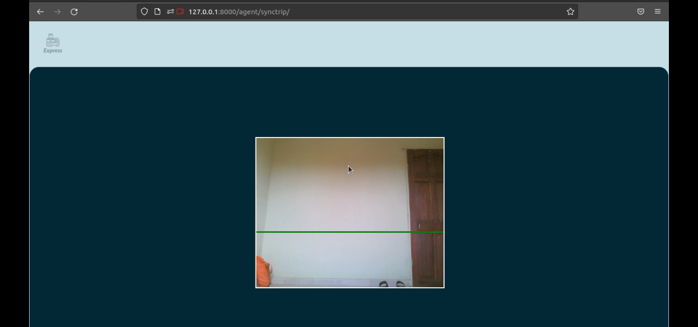
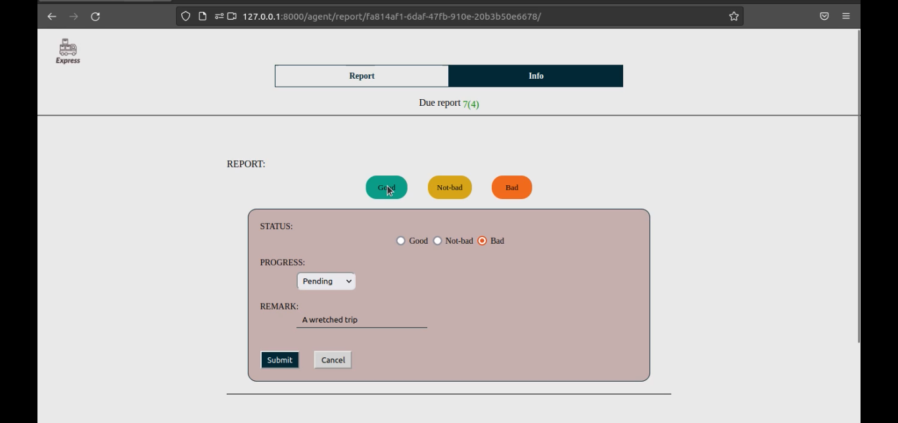

# transport
A trip management web application for a goods transport company. This project contain two django app(app and agent).


## Table of Contents

1. [Installation](#installation)
2. [Usage](#usage)
3. [Specification](#specification)
4. [User](#user)
5. [User-story](#user-story)
6. [Demo-images](#demo-images)


## Installation

1. Clone the repository:

    ```bash
    git clone https://github.com/SneezyG/transport
    ```

2. Navigate to the root directory:

    ```bash
    cd transport
    ```

3. Install dependencies:

    ```bash
    pip install -r requirements.txt
    ```
    
4. Add .env file at the root directory will a secret variable:
     
    ```bash
    secret = "your secret"
    ```
    
    
    
    

## Usage

1. Navigate to the project directory:

    ```bash
    cd transit
    ```

2. Start the development server:

    ```bash
    python3 manage.py runserver
    ```

3. Open your web browser and navigate to [http://localhost:8000](http://localhost:8000) to view the project.

4. Access the Django admin interface at [http://localhost:8000/admin/transit](http://localhost:8000/admin/transit).

5. Authenticate with any of these [User](#user) credentials to play around the application.


## Specification

FUNCTIONALITY.
manage bookings and trips.
monitor trips.
summarize transporter's closed trips and calculate their wages.
manage trips report.
report trips state and progress.

KEY-FEATURES.
users authentication and authorisation.
users management.
web-based trip barcode scanner. 
real time trips update.
logging system.
customizable admin interface.
responsive interface across devices.


## User

There are 4 type of user.
1. agent - submit trips report (admin: no permission).
2. supervisor - manage trips (admin: view trips and bookings permission).
3. manager(superuser)- create and monitor trips (admin: superuser permission).
4. payroll - manage transporters wages (admin: no permission).

Seeded the app with 4 users.
1. manager » user:sneezy pass:hshs627£-;"+#
2. supervisor » user:ogunboy pass:hshsj7373-£+
3. agent » user:adeboy pass:wyeha272#£
4. payroll » user:basito pass:hshhs27&#+#


## user-story

AGENT: submit trips report.
1. login into the application synctrip page.
2. scan trip barcode to sync trip.
3. submit reports for the synced trip.
4. view synced trip info.


SUPERVISOR: Manage trips.
1. login into the application manage page.
2. view all assigned trips.
3. manage trip progress.
4. manage trip reports.
5. monitor trips report status.
6. track trip location on map.


MANAGER: create trips.
1. login into the application admin interface.
2. in the booking model, add a new booking record.
3. in the trip model, create a new trip for the new booking.


MANAGER: monitor trips.
1. login into the application monitor page.
2. view all open trips.
3. monitor trips progress.
4. monitor trips latest report.
5. close trip.


PAYROLL: manage transporters wages.
1. login into the application payroll page.
2. enter transporter id.
3. select a date to calculate their wages from.
4. click the process button.
5. view transporter trip summary and wages.


## Demo-images

1. 
2. 
3. 
4. 
5. 
6. 
7. 


